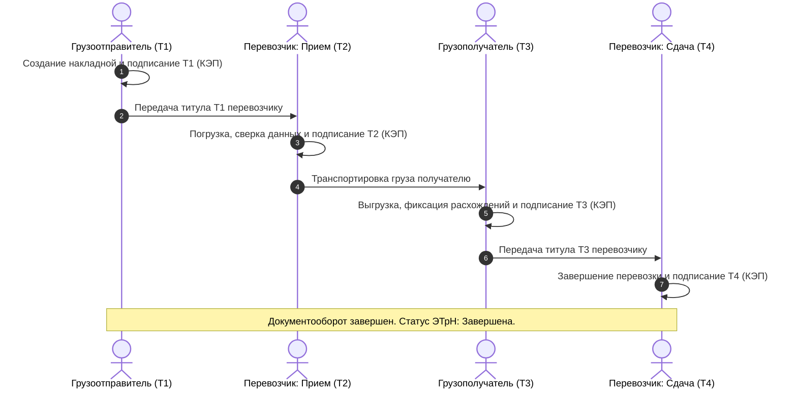

# Блок 1. Тестирование требований (Бизнес-процесс ЭТрН)

## Описание задачи
На основе краткого описания бизнес-процесса электронной транспортной накладной (ЭТрН):
1.  Составить чек-лист или набор тест-кейсов для проверки основного бизнес-процесса ЭТрН (создание, валидация полей, смена статусов, отображение реквизитов, обработка ошибок на базе BPMN-схемы).
2.  Описать ключевые проверки для формы документа на основе XSD-схемы ФНС.
3.  Привести несколько негативных проверок с указанием ожидаемого поведения и оформить 1-2 структурированных баг-репорта.

---

## Ход решения

Электронная транспортная накладная (ЭТрН) — это юридически значимый документ, регулируемый ФНС и Минтрансом РФ. Основной жизненный цикл ЭТрН состоит из последовательного подписания 4-х обязательных титулов КЭП (Квалифицированной электронной подписью) участниками перевозки.

---

### 1. Чек-лист проверки сквозного бизнес-процесса (BPMN Flow)

#### Создание и отправка Т1 (Грузоотправитель)
*   [ ] **Happy Path:** Успешное заполнение всех обязательных полей Т1, подписание КЭП грузоотправителя, отправка в ГИС ЭПД (Государственная информационная система электронных перевозочных документов) через оператора ИСЭПД. Статус накладной переходит в `Черновик` -> `Подписан Т1 (ГО)`.
*   [ ] **Валидация подписанта:** Проверка соответствия сертификата КЭП ИНН/ОГРН организации-отправителя. При несовпадении — вывод ошибки «Невалидный сертификат подписи».
*   [ ] **Отображение реквизитов:** Проверка, что после подписания Т1 поля блокируются для редактирования на стороне ГО.

#### Прием груза Перевозчиком (Т2)
*   [ ] **Happy Path:** Водитель/представитель перевозчика принимает груз, подписывает Т2 своей КЭП (или МЧД — машиночитаемой доверенностью). Статус ЭТрН меняется на `Груз в пути` / `Подписан Т2 (Перевозчик)`.
*   [ ] **Корректность данных Т2:** Проверка возможности зафиксировать замечания по массе/состоянию груза при погрузке. Эти оговорки должны отображаться в Т2 и Т3.

#### Выгрузка и получение груза (Т3)
*   [ ] **Happy Path:** Грузополучатель подписывает Т3 при разгрузке. Если принят без расхождений — статус `Принято без расхождений` / `Подписан Т3`.
*   [ ] **Приемка с расхождениями:** Проверка заполнения полей акта о расхождениях (недостача, брак) в Т3. Статус ЭТрН меняется на `Принято с расхождениями`. Информация должна мгновенно отобразиться у ГО и Перевозчика.

#### Сдача груза Перевозчиком (Т4)
*   [ ] **Happy Path:** Перевозчик завершает рейс, сверяет данные с Т3 и подписывает Т4 своей КЭП. Статус ЭТрН меняется на `Завершена`. Документ отправляется в архив и в ГИС ЭПД.

---

### 2. Ключевые проверки формы документа на основе XSD-схемы ФНС

XSD-схема задает жесткие требования к типам данных XML-документа. При тестировании интеграций (API) и интерфейсов ввода мы проверяем следующие сущности:

1.  **ИНН участников (Грузоотправитель, Перевозчик, Получатель):**
    *   *Проверка:* Только цифры. Длина должна быть строго 10 символов для юридических лиц и 12 символов для ИП/физических лиц. Шаблон регулярного выражения: `^\d{10}$|^\d{12}$`.
2.  **ОГРН / ОГРНИП:**
    *   *Проверка:* Строго 13 цифр для ОГРН юрлица, строго 15 цифр для ОГРНИП индивидуального предпринимателя.
3.  **КПП организации:**
    *   *Проверка:* Строго 9 символов. Допускаются цифры и заглавные латинские буквы (для крупнейших налогоплательщиков).
4.  **Государственный регистрационный номер транспортного средства (ГРЗ ТС):**
    *   *Проверка:* Соответствие форматам ГРЗ РФ (ГОСТ Р 50577-93), например, `^[АВЕКМНОРСТУХ]\d{3}[АВЕКМНОРСТУХ]{2}\d{2,3}$` (для легковых/грузовых автомобилей).
5.  **Даты и время:**
    *   *Проверка:* Соответствие стандарту ISO 8601 (`YYYY-MM-DDThh:mm:ss`), отсутствие будущих дат для фактического времени погрузки/выгрузки.
6.  **Вес брутто/нетто:**
    *   *Проверка:* Дробное положительное число, точность до 3 знаков после запятой (грамм). Значение веса брутто не может быть меньше или равно весу нетто.

---

### 3. Негативные проверки и баг-репорты

#### Негативные тест-кейсы
*   **Тест-кейс 1:** Попытка подписания Т2 (прием груза перевозчиком) до того, как грузоотправитель подписал Т1.
    *   *Ожидаемое поведение:* Система блокирует вызов функции подписания Т2 и выдает ошибку: «Невозможно принять груз: отсутствует подписанный титул грузоотправителя (Т1)».
*   **Тест-кейс 2:** Указание ИНН грузополучателя, состоящего из букв или неверной длины (например, 11 символов).
    *   *Ожидаемое поведение:* Валидатор XSD-схемы на клиенте/API выдает ошибку `XSD-VALIDATION-ERROR` с текстом: «Поле ИНН имеет неверный формат. Ожидается 10 или 12 цифр». Отправка документа блокируется.
*   **Тест-кейс 3:** Подписание Т3 (приемка груза) КЭП-сертификатом физического лица без приложенного XML-файла МЧД (Машиночитаемой доверенности).
    *   *Ожидаемое поведение:* Сервер возвращает ошибку авторизации подписи: «Подпись отклонена: для подписи физлица требуется действительная МЧД организации».

---

### Баг-репорты

#### Баг-репорт 1: Возможен переход ЭТрН в статус «Груз в пути» при ошибке валидации ГИС ЭПД для титула Т1

*   **Заголовок:** [ЭТрН][ГИС ЭПД] Смена статуса накладной на «Груз в пути» при отклонении титула Т1 на стороне ГИС ЭПД
*   **Шаги воспроизведения:**
    1.  Войти в личный кабинет Грузоотправителя.
    2.  Создать черновик ЭТрН, указав в Т1 заведомо неверный ОГРН получателя (например, 12 цифр вместо 13).
    3.  Подписать титул Т1 КЭП грузоотправителя и отправить.
    4.  Перевозчик немедленно открывает накладную в своем ЛК и подписывает титул Т2 (пока идет обработка Т1 в ГИС ЭПД).
    5.  Получить ответ от ГИС ЭПД: `Т1 отклонен. Ошибка: неверный ОГРН получателя`.
    6.  Проверить статус накладной в ЛК перевозчика и грузоотправителя.
*   **Фактический результат:** Статус накладной меняется на «Груз в пути» (на основе подписания Т2), несмотря на то, что первый титул Т1 был официально отклонен ГИС ЭПД с ошибкой валидации структуры.
*   **Ожидаемый результат:** Если ГИС ЭПД отклоняет Т1, документооборот должен быть заблокирован. Статус накладной должен стать «Отклонен ГИС ЭПД», а подписание Т2 должно быть заблокировано или аннулировано.
*   **Серьёзность (Severity):** **Critical** (Бизнес-логика нарушена. Создается юридически недействительный электронный документ, который не примет налоговая).

---

#### Баг-репорт 2: Отсутствие проверки обязательного поля «Адрес места погрузки» в Т1 на уровне API

*   **Заголовок:** [API][Т1] Успешное создание титула Т1 через POST `/api/v2/etrn/t1` с пустым полем `loading_address`
*   **Шаги воспроизведения:**
    1.  Отправить POST-запрос на `/api/v2/etrn/t1` для создания титула Т1.
    2.  В теле запроса (JSON Payload) полностью удалить параметр `loading_address` (или передать пустую строку `""`).
    3.  Остальные обязательные реквизиты (ИНН, ОГРН, вес, данные ТС) заполнить валидно.
    4.  Проверить HTTP статус-код ответа и тело ответа.
*   **Фактический результат:** Сервер возвращает `201 Created` с JSON накладной. В БД создается запись ЭТрН без адреса погрузки.
*   **Ожидаемый результат:** Сервер должен возвращать `400 Bad Request` со списком ошибок валидации: `{"error": "Validation failed", "details": {"loading_address": "Field is mandatory"}}`, так как по XSD-схеме ФНС адрес места погрузки является обязательным реквизитом.
*   **Серьёзность (Severity):** **Major** (Несоответствие XSD-схеме регулятора приведет к гарантированному отклонению документа при выгрузке в ГИС ЭПД).
